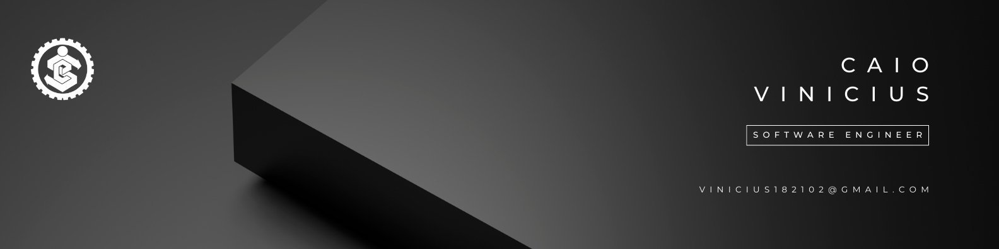

## Olá! Me chamo Caio! ✋

<!--[ IMAGES ]-->

  

---

<!--[ TECHNOLOGIES ]-->
<h3 align="center" style="font-weigth: bold;">Technologies</h3>
### Operating Systems

  
  
  
  
  

### Programming Languages

  
  
  
  
  
  
  

### Frameworks & Runtimes

  
  

### Databases

  
  
  

### Tools & Others

  
  
  

---
<!--[ PROJECTS ]-->
## Some Projects

